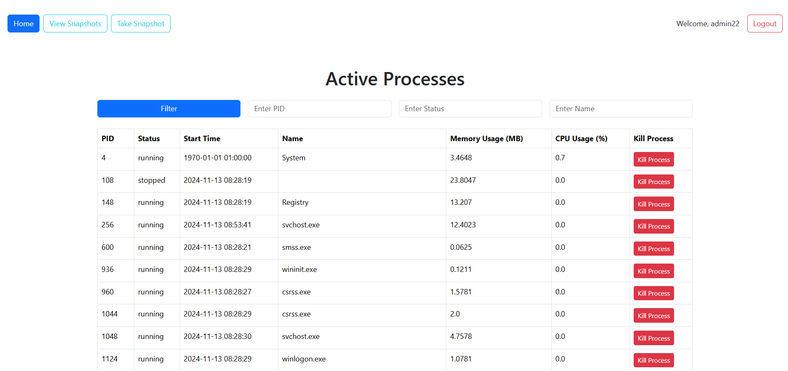

# Management Tool

Management tool using a Python web framework Django, that allows remote monitoring and control of processes running on the machine where the application is deployed

## Demo



### Features

* Login and registration functionality for User
* Managing active processes on your PC
* Filtering processes
* Taking snapshots of processes and view their


## Check it out!

(You would need to wait for ~5 seconds for the data to be loaded)


### Installing locally / Getting started

Python3 must be already installed

```shell
git clone https://github.com/BohdanKuzik/management_tool.git
cd management_tool
python3 -m venv venv
source venv/bin/activate  # On Windows use `venv\Scripts\activate`
```
Install dependencies
```shell
pip install -r requirements.txt
```

Migrate the database, generate initial data and run server
```shell
python manage.py migrate
python manage.py createsuperuser #if you want to have more permissions 
python manage.py runserver
```

After running that code you'll be able to browse the website locally on your computer

All data reload automatically every 30 seconds.<br>
After clicking button: "take snapshot" you need to wait a few seconds :)


